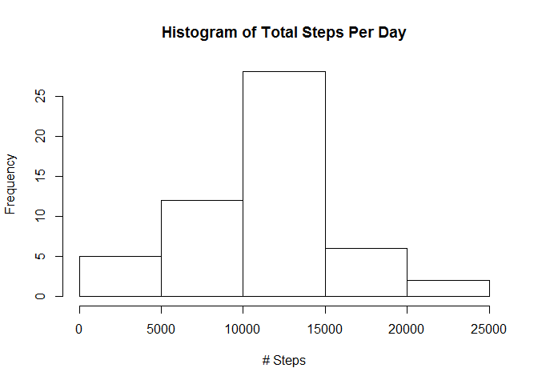
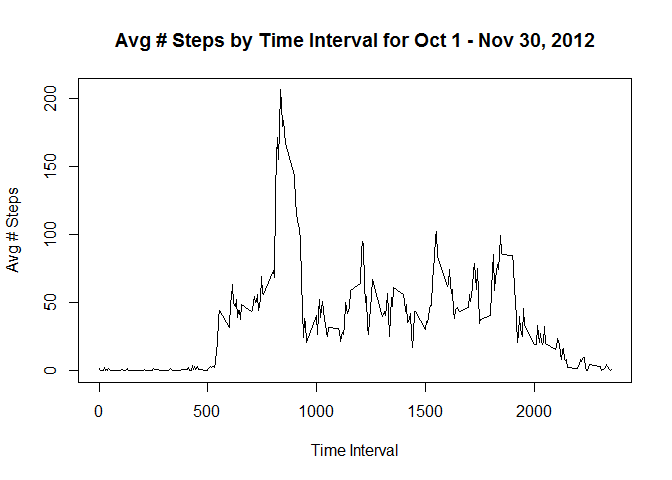
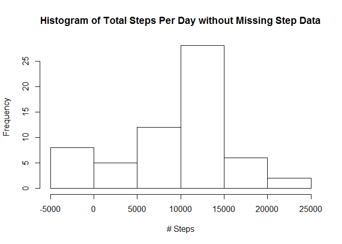
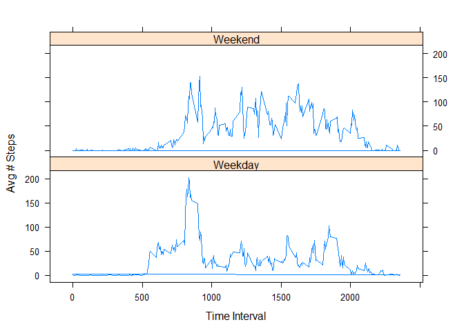

# Reproducible Research: Peer Assessment 1

Load the data 'activity.csv' into a data.frame

## Loading and preprocessing the data


```r
ds <- read.csv('activity.csv')
```
<br /><hr /><br />

Calculate the total # of steps taken per day and then show histogram of the results.


```r
stepsPerDay <- aggregate(ds$steps, by=list(Category = ds$date), FUN=sum)
hist(stepsPerDay$x, main="Histogram of Total Steps Per Day", xlab = "# Steps")
```

 

Calculate both mean and median of total number of steps per day and show results.

## What is mean total number of steps taken per day?


```r
mnspd <- mean(stepsPerDay$x, na.rm=T)
mdspd <- median(stepsPerDay$x, na.rm=T)
```

Mean steps per day (R variable mnspd): **10766.19**  
Median steps per day (R variable mdspd): **10765**

<br /><hr /><br />

Time series plot of the 5-minute interval and the average number of steps taken, averaged across all days.

## What is the average daily activity pattern?


```r
meanStepsByInterval <- aggregate(steps ~  interval, ds, mean)
plot(meanStepsByInterval$interval, meanStepsByInterval$steps, type="l", xlab="Time Interval", ylab="Avg # Steps", main = "Avg # Steps by Time Interval for Oct 1 - Nov 30, 2012")
```

 

Calculate which 5-minute interval contains the maximum number of steps and display result


```r
maxObservation <- meanStepsByInterval[meanStepsByInterval$steps == max(meanStepsByInterval$steps), ]
```
5-minute interval containing maximum avg steps: **835**

<br /><hr /><br />

Calculate and report the total number of missing values in the dataset 


```r
mv <- sum(is.na(ds$steps))
```
Number of observations with missing steps data (R variable mv): **2304**

Let's use the Zoo package to fill in the missing values - first load the library

## Imputing missing values


```r
library(zoo)
```

Create a new dataset and use na.spline() function to fill in missing values


```r
nds <- ds
nds$steps = na.spline(nds$steps)
mv <- sum(is.na(nds$steps))
```
Number of observations with missing steps data (R variable mv): **0**

Calculate and display new histogram of the total number of steps taken each day


```r
stepsPerDay <- aggregate(nds$steps, by=list(Category = nds$date), FUN=sum)
hist(stepsPerDay$x, main="Histogram of Total Steps Per Day without Missing Step Data", xlab = "# Steps")
```

 

Calculate new mean and median total number of steps taken per day

## Are there differences in activity patterns between weekdays and weekends?


```r
fmnspd <- mean(stepsPerDay$x, na.rm=T)
fmdspd <- median(stepsPerDay$x, na.rm=T)
```

Mean steps per day (R variable fmnspd): **9349.042**  
Median steps per day (R variable fmdspd): **10395.00**

After filling in the missing step data, we can see the Mean steps per day dropped from **10766.19** to **9349.042**,   
and the Median steps per day dropped from **10765** to **10395.00**

<br /><hr /><br />

Show any differences in activity patterns between weekdays and weekends.  Convert date from factor to date, and then create new factor variable dayType to distinguish between weekdays and weekends.


```r
nds$date <- as.POSIXct(nds$date)
nds$IsWeekend <- grepl("Saturday|Sunday", weekdays(nds$date))
nds$dayType <- as.factor(ifelse(nds$IsWeekend, "Weekend", "Weekday"))
```

Use Lattice library xyplot function to create panel plot showing difference in weekday vs weedend avg steps.  First, calculate mean steps by interval for each factor (weekend/weekday) and then assign to data frame.


```r
meanStepsByIntervalWeekdays <- aggregate(steps ~  interval, nds[nds$dayType == "Weekday",], mean)
meanStepsByIntervalWeekends <- aggregate(steps ~  interval, nds[nds$dayType == "Weekend",], mean)

nds[nds$dayType=="Weekday", 1] <- meanStepsByIntervalWeekdays$steps
nds[nds$dayType=="Weekend", 1] <- meanStepsByIntervalWeekends$steps

library(lattice)
xyplot(steps ~ interval | dayType, data = nds, layout=c(1,2), type="l", xlab="Time Interval", yla="Avg # Steps")
```

 

